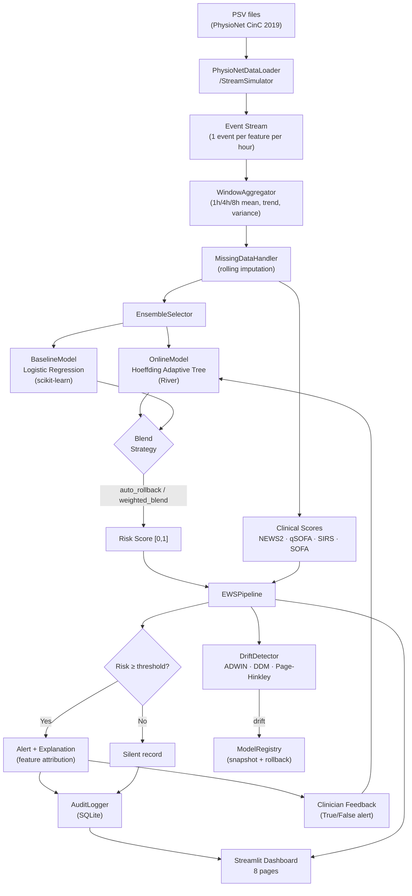

# SepsisGuard — Real-Time Patient Deterioration Early Warning System

[](https://www.python.org/)
[](https://streamlit.io/)
[](https://scikit-learn.org/)
[](https://riverml.xyz/)
[](https://physionet.org/content/challenge-2019/)
[](LICENSE)
[]()

> **⚠️ Not a medical device.** This is a research prototype for studying streaming clinical ML. It is not validated for real patient care. See [Regulatory Note](#-regulatory-note).

---

## 🎯 What is SepsisGuard?

**SepsisGuard** is a research-grade, real-time **Early Warning System (EWS)** for ICU patient deterioration — specifically targeting **sepsis onset prediction 4–6 hours before it is clinically confirmed**.

Hospitals currently rely on simple rule-based scores (NEWS2, qSOFA, SIRS). These scores are useful but have significant weaknesses:

| Problem with rule-based scores | How SepsisGuard addresses it |
|---|---|
| Treat each vital sign in isolation | Learns multi-vital patterns via sliding-window ML features |
| Static thresholds, no adaptation | Online Hoeffding Adaptive Tree updates continuously from clinician feedback |
| No memory of patient history | 1h / 4h / 8h window aggregates (mean, trend, variability) |
| Can't improve from ward outcomes | Delayed-label learning loop trains online model after 6h confirmation window |
| Only alert, no explanation | Feature attribution tells clinicians *why* risk is elevated |

**Who is this for?** Students, engineers, and researchers exploring **streaming clinical machine learning** — not bedside deployment.

---

## ✨ Features

### Machine Learning
| Feature | Description |
|---|---|
| **Dual-model architecture** | Frozen logistic regression (safety net) + online Hoeffding Adaptive Tree (learning) |
| **Weighted-blend ensemble** | Configurable 60/40 online/baseline blend; auto-rollback when AUROC degrades |
| **Delayed-label learning** | Features queued; model trained after 6h prediction window or clinician feedback |
| **Online AUROC tracking** | Rolling AUROC compared against baseline with automatic rollback at −5% gap |
| **Feature engineering** | ~250 features: 1h/4h/8h mean, trend, variability per vital/lab |
| **Drift detection** | ADWIN, DDM, Page-Hinkley monitor the score stream simultaneously |

### Clinical Scoring
| Score | Fields used |
|---|---|
| **NEWS2** | RR, SpO2, Temp, SBP, HR |
| **qSOFA** | RR, SBP (without GCS — not in dataset) |
| **SIRS** | Temp, HR, RR, WBC |
| **SOFA** (partial) | FiO2/SaO2 ratio, Platelets, Bilirubin, Creatinine |

### Dashboard (8 pages)
| Page | What you see |
|---|---|
| 🚨 **Patient Alerts** | High-risk cards with SOFA badge, vital sparklines (risk/NEWS2/SOFA trends), explainability, clinician feedback buttons |
| 🏥 **Ward Census** | All patients ranked by ML risk, severity bar chart, CSV download, lab vitals toggle |
| 📈 **Patient Timeline** | Risk vs online vs baseline score over time, alert markers, NEWS2 overlay |
| 🌡️ **Risk Heatmap** | Patient × time heatmap — spot clusters of deteriorating patients at a glance |
| 📋 **Shift Handoff** | Severity donut chart, PPV from feedback, alert rate/hr, top-risk table |
| 📊 **Performance** | Rolling AUROC chart, score distribution, online vs baseline scatter, precision-recall |
| 🃏 **Model Card** | Model identity, performance metrics, feature importance bar chart, regulatory note |
| ⚙️ **Admin** | Ensemble strategy selector, blend weights, rollback, shadow mode, audit CSV export |

---

## 🏗️ Architecture



---

## 📁 Project Layout

```
SepsisGuard/
├── config/
│   └── settings.yaml               # Thresholds, windows, paths, ensemble strategy
│
├── src/
│   ├── pipeline.py                 # Main orchestrator (EWSPipeline)
│   ├── clinical/
│   │   └── scores.py               # NEWS2, qSOFA, SIRS, SOFA (new)
│   ├── features/
│   │   ├── window_aggregator.py    # 1h/4h/8h sliding windows
│   │   └── missing_handler.py      # Rolling imputation
│   ├── models/
│   │   ├── baseline_model.py       # Frozen LR / XGBoost safety net
│   │   ├── online_model.py         # River Hoeffding Adaptive Tree
│   │   ├── ensemble.py             # auto_rollback / weighted_blend strategy
│   │   └── registry.py            # Model versioning & snapshots
│   ├── drift/
│   │   └── detector.py             # ADWIN, DDM, Page-Hinkley
│   ├── explainability/
│   │   └── explainer.py            # Feature attributions in plain English
│   ├── audit/
│   │   └── logger.py               # Append-only SQLite prediction log
│   └── ingestion/
│       ├── stream_simulator.py     # PSV file replay engine
│       └── kafka_adapter.py        # Optional Kafka source
│
├── dashboard/
│   ├── app.py                      # Main Streamlit app (8 pages)
│   ├── monitoring.py               # Performance page
│   └── components/
│       ├── alert_panel.py          # Alert cards with sparklines + SOFA
│       ├── ward_census.py          # Patient table with bar chart + CSV
│       ├── patient_timeline.py     # Risk timeline chart
│       ├── risk_heatmap.py         # [NEW] Patient × time risk heatmap
│       ├── model_card.py           # [NEW] Model transparency card
│       ├── shift_summary.py        # Donut chart + PPV + alert quality
│       └── drift_chart.py          # Drift detector status
│
├── scripts/
│   ├── train_baseline.py           # Offline baseline training
│   ├── simulate_stream.py          # CLI stream simulation
│   └── download_dataset.py         # PhysioNet dataset downloader
│
├── data/
│   └── training_setA/training/     # ~40,336 PSV patient files
│
├── models/                         # Trained model artifacts
│   ├── baseline_model.pkl
│   ├── baseline_meta.json
│   ├── feature_importance.json
│   └── snapshots/
│
├── logs/
│   └── audit.db                    # SQLite audit log
│
├── tests/                          # Pytest test suite
└── requirements.txt
```

---

## 🚀 Quick Start

### Prerequisites

```bash
py -3 -m pip install -r requirements.txt
```

> Dataset is already under `data/training_setA/training/` (~40,336 `.psv` files).
> To re-download: `python scripts/download_dataset.py`

---

### Step 1 — Train the Baseline Model

```bash
# Recommended first run (fast, ~5-10 minutes)
py -3 scripts/train_baseline.py --n-patients 500 --sample-every 3

# Full training (all ~40K patients — may take 30-60 min)
py -3 scripts/train_baseline.py

# Train XGBoost instead of Logistic Regression
py -3 scripts/train_baseline.py --model xgboost --n-patients 500
```

**Output:** `models/baseline_model.pkl`, `models/baseline_meta.json`, `models/feature_importance.json`

**Typical results (500 patients):**
```
Test AUROC:    ~0.76–0.82
Test AUPRC:    ~0.25–0.40
Sensitivity:   ~0.70–0.85
Specificity:   ~0.65–0.80
```

---

### Step 2 — Run the Dashboard

```bash
py -3 -m streamlit run dashboard/app.py
```

1. In the sidebar, set **N ICU stays** (e.g., 80)
2. Click **▶ Start** — the stream begins replaying patient data
3. Navigate between the 8 dashboard pages

---

### Step 3 — CLI Simulation (optional)

```bash
# Quick headless simulation
py -3 scripts/simulate_stream.py --n-patients 40 --no-realtime --max-events 400
```

---

### Step 4 — Run Tests

```bash
py -3 -m pytest tests/ -v --tb=short
```

---

## ⚙️ Configuration Reference

Edit `config/settings.yaml`:

| Key | Default | Description |
|---|---|---|
| `alerting.risk_threshold` | `0.65` | ML risk score threshold for firing an alert |
| `alerting.alert_cooldown_minutes` | `30` | Minimum minutes between alerts for the same patient |
| `outcome.prediction_window_hours` | `6` | Hours before delayed label is applied to online model |
| `features.window_sizes_minutes` | `[60, 240, 480]` | Sliding window sizes for feature aggregation |
| `ensemble.strategy` | `auto_rollback` | `auto_rollback` / `weighted_blend` / `online_only` / `baseline_only` |
| `ensemble.blend_online_weight` | `0.6` | Online model weight in weighted blend mode |
| `baseline.rollback_auroc_gap` | `0.05` | AUROC drop from baseline that triggers auto-rollback |
| `online_model.type` | `hoeffding_adaptive_tree` | River model type (`hoeffding_adaptive_tree` or `logistic_regression`) |
| `online_model.shadow_mode` | `false` | If true, predictions logged but alerts suppressed |
| `drift.adwin_delta` | `0.002` | ADWIN sensitivity (smaller = more sensitive) |
| `streaming.speed_multiplier` | `60` | Simulation speed (60× = 1 hour per second) |
| `paths.training_dir` | `data/training_setA/training` | PSV file directory |

---

## 🔬 How a Prediction is Made

```
1. PSV patient file (hourly vitals + labs + SepsisLabel)
   → Event stream: one event per (patient, hour, feature)
   → WindowAggregator: 1h/4h/8h mean, trend, variability (~250 features)
   → MissingDataHandler: rolling median imputation for missing labs

2. EnsembleSelector picks strategy:
   auto_rollback → use online model; if AUROC drops >5% → switch to baseline
   weighted_blend → 0.6 × online + 0.4 × baseline
   online_only / baseline_only → single model

3. Clinical scores computed from latest vitals:
   NEWS2, qSOFA, SIRS, SOFA (partial)

4. If risk_score ≥ threshold (default 65%):
   → Alert fires + feature attribution generated ("HR trend elevated: +12 bpm/4h")
   → AuditLogger records prediction_id, score, features, explanation

5. Drift detectors check every 50 predictions:
   ADWIN, DDM, Page-Hinkley on score stream
   → If drift: snapshot model, log event

6. Clinician feedback (True/False alert) → immediate label for online model
   Delayed label: features queued, online model trained after 6h
```

---

## 🧠 Design Decisions

| Decision | Rationale |
|---|---|
| **Delayed labels** | Sepsis is not known at the moment of vital measurement. The online model must wait for the prediction window (or clinician confirmation) before learning — otherwise it would peek at future information. |
| **Dual model with rollback** | The online model can degrade if it receives poor or unbalanced feedback. The frozen baseline serves as a safety floor. Auto-rollback triggers when online AUROC falls more than 5% below the baseline AUROC. |
| **Weighted blend mode** | Provides a middle ground: the online model contributes 60% of the score and baseline 40%, giving adaptation benefits without fully trusting an undertrained online model. |
| **Patient-level train/test split** | Hours from the same patient must not appear in both train and test sets — this is a classic clinical ML leakage trap. |
| **Partial SOFA** | Full SOFA requires GCS (mental status) and urine output, neither of which is in the CinC 2019 dataset. We compute the 4 available sub-scores: respiration (SaO2/FiO2), coagulation (platelets), liver (bilirubin), renal (creatinine). |
| **Feature attribution without SHAP** | Full SHAP on a streaming system is too slow. We use model coefficients (LR) or feature importances (XGBoost/HAT) ranked by magnitude, then map feature names to plain English labels. |
| **SQLite audit log** | Append-only, no external dependencies. In a real deployment this would be a HIPAA-compliant database with access controls. |

---

## 📊 Dataset

**PhysioNet/CinC Challenge 2019 — Early Prediction of Sepsis from Clinical Data**

- **Source:** Reyna et al., 2019 · [physionet.org](https://physionet.org/content/challenge-2019/)
- **Kaggle mirror:** [salikhussaini49/prediction-of-sepsis](https://www.kaggle.com/datasets/salikhussaini49/prediction-of-sepsis)
- **Format:** ~40,336 pipe-separated (`.psv`) patient files
- **Features:** 34 clinical variables (8 vitals, 26 labs/demographics) + hourly SepsisLabel
- **Sepsis prevalence:** ~7.6% of patients

---

## ⚖️ Regulatory Note

Adaptive ML models that could influence patient care are classified as **Software as a Medical Device (SaMD)** by the FDA and EMA. Before any real-world deployment you would need:

- 🏥 **IRB review** and prospective clinical validation
- 📋 **Extensive shadow-mode validation** alongside current care
- 🔐 **HIPAA / GDPR compliance** for any real patient data
- 🔄 **Change-control plan** for online model updates
- 📝 **510(k) clearance** or equivalent regulatory pathway

**This repository does none of that.** It is purely for research and education.

---

## 📦 Requirements

```
river>=0.21.0            # Online learning framework
scikit-learn>=1.4.0      # Offline training
xgboost>=2.0.0           # XGBoost baseline option
pandas>=2.0.0
numpy>=1.26.0
streamlit>=1.35.0        # Dashboard
plotly>=5.20.0           # Charts
sqlalchemy>=2.0.0        # Audit DB
pyyaml>=6.0.0
joblib>=1.3.0
tqdm>=4.66.0
scipy>=1.12.0
imbalanced-learn>=0.12.0
shap>=0.45.0
```

---

## 📄 License

Code: **MIT** — see `LICENSE` if present.

Dataset: PhysioNet/CinC Challenge 2019 — Reyna et al., 2019.
Data used here via Kaggle mirror: [prediction-of-sepsis](https://www.kaggle.com/datasets/salikhussaini49/prediction-of-sepsis).
See `data/LICENSE.txt` for the PhysioNet data license.

---

## 🙏 Acknowledgements

- **PhysioNet** and the organizers of the CinC Challenge 2019 for the dataset
- **River** ML team for the outstanding online learning library
- **Streamlit** for making interactive data apps accessible
- **Plotly** for beautiful interactive charts
